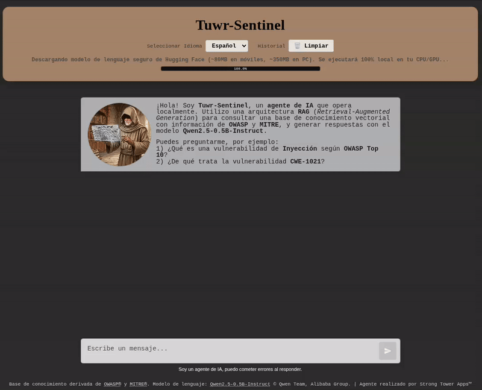

# 🛡️ Tuwr-Sentinel (Demo)

**Tuwr-Sentinel** es un agente de Inteligencia Artificial diseñado para asistir y responder consultas especializadas sobre ciberseguridad, enfocándose específicamente en los marcos de trabajo de **OWASP** y **MITRE**.

Esta versión es una demostración técnica interactiva que opera bajo una arquitectura de **RAG  (Retrieval-Augmented Generation)**, ejecutándose por completo de forma local.

---

## 🚀 Características Principales

- **RAG Local**: La base vectorial, la búsqueda semántica y la inferencia del modelo de lenguaje (LLM) se realizan localmente en el cliente sin enviar datos a servidores externos.
- **Especializado en OWASP & MITRE**: Consulta de manera ágil y precisa técnicas de ataque, vulnerabilidades comunes (CWE) y sus respectivas mitigaciones.
- **Multilingüe**: Soporte completo para consultas y bases de conocimiento tanto en **español** como en **inglés**.
- **Ejecución Adaptativa**: Aprovecha tecnologías como **WebGPU** y **WASM (WebAssembly)** a través del hardware local.
- **Demostración de Seguridad**: Implementa defensas a nivel de cliente contra inyecciones de prompts (sanitización de ChatML) y escape estricto de salidas para evitar vulnerabilidades de Cross-Site Scripting (XSS), aunque sea para una demo Local.

---

## 🛠️ Tecnologías Utilizadas

- **Motor de Inferencia**: ONNX Runtime Web.
- **Modelo Base Adaptativo**:
  * 💻 **Escritorio**: `Qwen2.5-0.5B-Instruct` (~350MB, cuantizado en Q4) para obtener la máxima precisión de respuesta.
  * 📱 **Móviles / Tablets**: Fallback automático a `SmolLM2-135M-Instruct` (~80MB, cuantizado en Q4) para optimizar el consumo de memoria RAM y evitar crashes en navegadores móviles.
- **Búsqueda Vectorial**: Motor de búsqueda semántica local de alta velocidad (Orama).
- **Interfaz**: Aplicación Web Reactiva (HTML5, Vanilla CSS, JS moderno).

---

## 💻 Uso de la Demo

1. Abre la URL publicada de la aplicación.
2. Espera a que el modelo base adecuado y la base de conocimiento local se carguen en la memoria del navegador (este proceso ocurre una sola vez al inicio).
3. Selecciona tu idioma de preferencia (Español / Inglés).
4. Empieza a realizar preguntas sobre vulnerabilidades OWASP o técnicas de MITRE.

---

## 🔒 Seguridad y Transparencia en la Descarga de Modelos

Dado que este agente de IA opera de forma enteramente local, al abrir la aplicación por primera vez tu navegador web descargará los modelos directamente de los repositorios oficiales de **Hugging Face** a tu caché local:
* **Origen de Confianza**: Todas las peticiones de descarga se realizan de forma transparente y segura mediante HTTPS hacia los servidores oficiales de Hugging Face (`cdn-lfs.huggingface.co`), el portal estándar de la industria para modelos de Machine Learning.
* **Procesamiento 100% Local**: Una vez descargado el modelo, el navegador web lo compila e inicia el procesamiento matemático de inferencia en tu procesador (CPU) o tarjeta gráfica (GPU) mediante WebAssembly y WebGPU. **Tus datos e historial de chat nunca salen de tu dispositivo** y no se envían a ningún servidor externo de terceros.

---

## 🎥 Grabación de Validación y Demostración en Acción

Por si no deseas realizar la descarga inicial en tu dispositivo, puedes observar la funcionalidad del agente en la siguiente grabación:

---

## ⚠️ Nota Importante sobre Producción y Arquitectura a Escala

Este proyecto es una **demostración conceptual (Proof of Concept)** que tiene como fin ilustrar la interacción en tiempo real de los componentes en un cliente estático local, sin depender de servidores backend costosos de mantener. 

**No se recomienda esta arquitectura local para proyectos empresariales o en producción real** debido a las limitaciones inherentes del cliente (tiempo de carga inicial al descargar el modelo, uso intensivo de la memoria RAM del navegador, variabilidad de hardware del usuario y dificultad para actualizar los datos del vector en tiempo real).

### 🏛️ Arquitectura de Producción Recomendada (A Escala)
Para un entorno productivo robusto, seguro y escalable, la arquitectura recomendada es **Cloud-Native / Híbrida**:

1. **Cliente Liviano (SPA/SSR)**: Una interfaz frontend construida en frameworks como React o Next.js, que no realiza tareas de inferencia ni almacena datos locales. Consume APIs mediante streaming de texto (SSE) para brindar una experiencia instantánea al usuario independientemente de su dispositivo.
2. **Backend de Orquestación (API Gateway)**: Un servicio backend seguro (FastAPI, NestJS o Node.js con LangChain/LlamaIndex) que valida los prompts del usuario, gestiona políticas de seguridad y administra la sesión de chat.
3. **Base de Datos Vectorial Centralizada**: Un motor de base de datos vectorial gestionado (como **Qdrant**, **Pinecone**, **Milvus** o Postgres con **pgvector**) que almacena millones de documentos de seguridad indexados, permitiendo actualizaciones en tiempo real y búsquedas en milisegundos desde el backend.
4. **Inferencia del LLM Escalable**:
   * **Servicio Gestionado**: Uso de APIs empresariales de alto rendimiento (OpenAI, Claude, Gemini) con protección de datos comerciales.
   * **Infraestructura Privada**: Despliegue de modelos de código abierto a gran escala (como Llama 3 o Qwen 2.5 de parámetros completos) en servidores de GPU propios o dedicados a través de motores de inferencia escalables como **vLLM**, **TGI** (Text Generation Inference) o **Ollama**.

---
*Agente IA Desarrollado por **Strong Tower Apps™**.*
